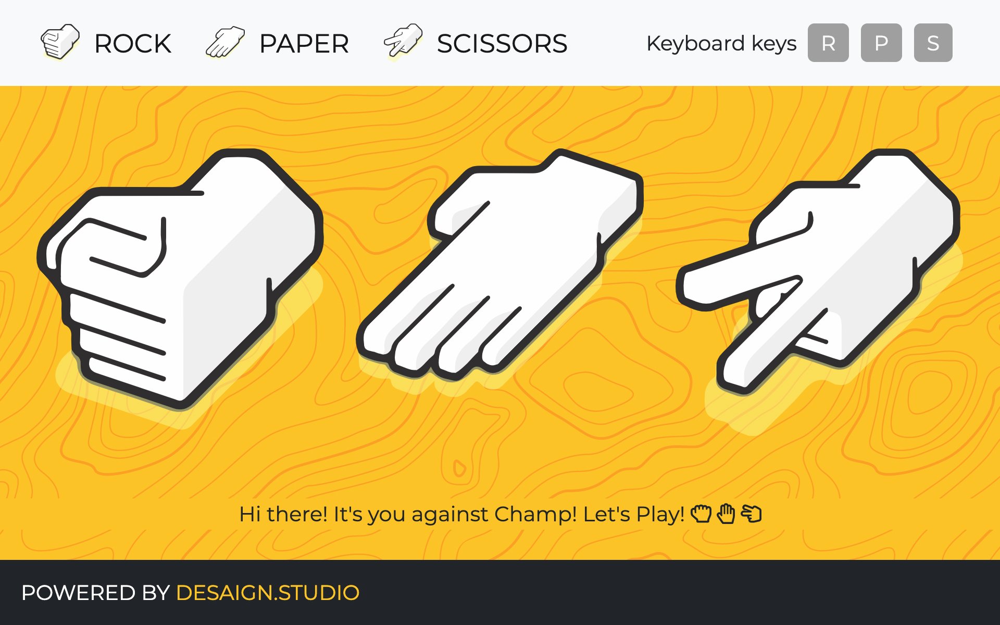

# Rock Paper Scissors by Desaign Studio

Play Scissors < Rock < Paper < Scissors. Rock paper scissors is a hand game usually played between two people, in which each player simultaneously forms one of three shapes with an outstretched hand. These shapes are "rock" (a closed fist), "paper" (a flat hand), and "scissors" (a fist with the index finger and middle finger extended, forming a V).

### Gameplay

- Either click keybord keys or click on icons to select.
    - Press `R` for **Rock**
    - Press `P` for **Paper**
    - Press `S` for **Scissors**
- You are playing against Champ (Computer which randomly select in between `R`, `P` and `S`).
- The game has only two possible outcomes: a draw, or a win for one player and a loss for the other. 
- A player who decides to play rock will beat another player who has chosen scissors ("rock crushes scissors"), but will lose to one who has played paper ("paper covers rock"); a play of paper will lose to a play of scissors ("scissors cuts paper"). 
- If both players choose the same shape, the game is tied and is usually immediately replayed to break the tie.

### Version

- **2103161149**
✔ Last Update @done (March 24th 2021, 14:12)

### Framework

- HTML5, CSS3, JavaScript

### Built With

- JQuery, Bootstrap, Google Fonts, SVG

### Software

- Visual Studio Code Editor
- Github for versioning

### CONTRIBUTE

- A [contributing guideline](https://github.com/kratuvwxyz/CONTRIBUTE) available.

### LICENSE

- [MIT](https://github.com/kratuvwxyz/LICENSE) © 2021 Kratu Desai, DESAIGN LLC.

### Upcoming Versioning

- Multi-player options
- Chat features

## CONTACT

Thank you for your time and consideration. My mantra is simple, *chase perfection to catch excellence*. I hope you enjoy my work. **I'd love to hear from you.** Please email me at <a href="mailto:github@desaign.studio?Subject=Message from Github">github@desaign.studio</a>.

 &copy; 2011-2021. <a href="https://desaign.app" target="_blank" style="text-decoration:none;">DESAIGN STUDIO</a>. All Rights Reseverd. &#160;
 &#160;
 &#160;
 &#160;
 &#160;